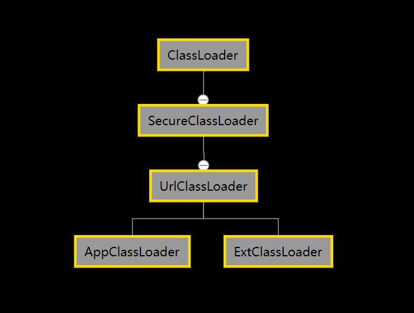
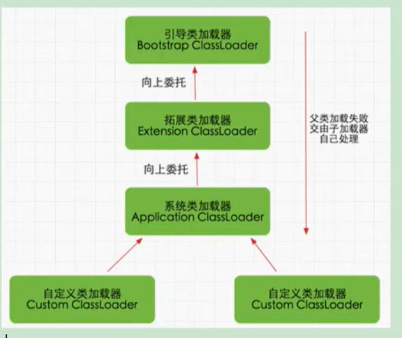
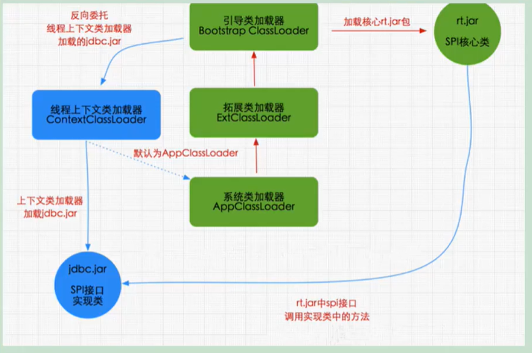
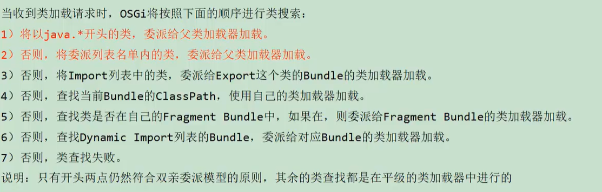
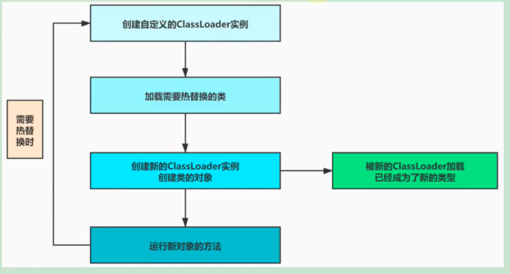
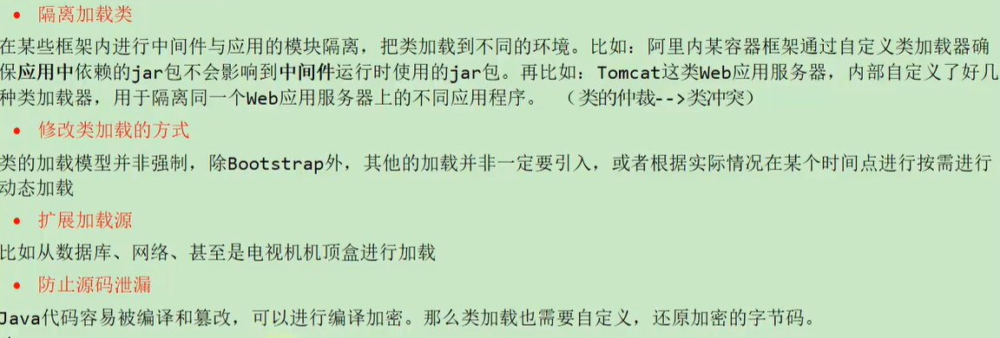

# ClassLoader

### 类的加载方式

是指虚拟机将class文件加载到内存的方式，分为类的显式加载和隐式加载

- 类的显式加载就是通过反射的方式得到class文件得到对象
```java
public void test(){
 try{
  Class clazz=Class.forName("org.abliger.demo1.TestMyClassLoader");
  ClassLoader.getSystemClassLoader.loadClass("org.abliger.demo1.TestMyClassLoader");
 }catch(Execption e){
 e.printStackTrace();
 }
}
```

- 类的隐式加载

  隐式加载指不需要在java代码中明确调用加载的代码，而是通过虚拟机自动加载到内存中。比如在加载某个class时，该class引用了另外一个类的对象，那么这个对象的字节码文件就会被虚拟机自动加载到内存中。

  ```java
  public void test(){
  	TestMyClassLoader testMyClassLoader=new TestMyClassLoader();
  }
  ```

  

### 类的唯一性

对于任何一个类，都需要一个类加载器，加载该类的class文件，通过双亲委派机制来保证该类只被加载一次

但如果一个类的class文件是由不同的类加载器加载，那么该两个class就不相同

即：比较两个类是否相等，只有这两个类是由同一个类加载的才有意义

### 类加载器的命名空间

命名空间是由该类加载器以及其父类加载器所构成的，子类加载的类对父类不可见，同一个命名空间中一定不会出现同一个类（全限定名，包括包名一模一样的类）多个Class对象，换句话说就是在同一命名空间中只能存在一个Class对象，所以当你听别人说在内存中同一类的Class对象只有一个时其实指的是同一命名空间中。
```java
     final MyClassLoader myClassLoader1 = new MyClassLoader("file:///D:/A-program/idea/program/test/classLoader/classLoader/src/");
     final MyClassLoader myClassLoader2 = new MyClassLoader("file:///D:/A-program/idea/program/test/classLoader/classLoader/src/");
     final Class clazz1 = myClassLoader1.findClass("org.abliger.demo2.demo");
     // final Class clazz2 = myClassLoader1.findClass("org.abliger.demo2.demo");
     final Class clazz3 = ClassLoader.getSystemClassLoader().loadClass("org.abliger.demo2.demo");
     final Object o1 = clazz1.newInstance();
     // final Object o2 = clazz2.newInstance();
     final Object o3 = clazz3.newInstance();
     System.out.println(o1.getClass().getClassLoader());//org.abliger.demo2.MyClassLoader@4554617c
     System.out.println(o1==o3);//false
```

## 类的加载器

### 类的加载器的分类：

 - 引导类加载器

   由C、C++实现

   只加载包名为java、javaX、sun开头的类

   它用来加载Java核心库（rt.jar），用于提供jvm所需要的类

   加载扩展类加载器，和应用程序类加载器，并指定为他们的父类

 - 扩展类加载器

   加载java.ext.dirs路径下的类

 - 应用程序类加载器

   负责加载环境变量classpath或系统属性java.class.path路径下的库

 - 自定义加载器

   可以加载本地或网络上的class文件

   通过自定义加载器，可以实现应用隔离，如Tomcat，Spring，是用自定义加载器隔离不同组件模块

   可以对class文件进行再编码，解码实现防止逆向查看源码

 ```java
 public static void main(String[] args) {
         getBootstrapClassLoader();
         System.out.println("=================");
         getExtClassLoaderDir();
         System.out.println("=================");
         getAppClassLoaderDir();
         /*
         我们从打印结果可以得到AppClassLoader可以扫描到BootstrapClassLoader和ExtClassLoader加载的类，BootstrapClassLoader和ExtClassLoader扫描路径不重复
          */
     }
     //bootstrapClassLoader
     public static void getBootstrapClassLoader(){
         final String bootstrapClassLoader = System.getProperty("sun.boot.class.path");
         System.out.println("bootstrapClassLoader = " + bootstrapClassLoader);
         System.out.println("加载的路径");
         for (String s : bootstrapClassLoader.split(";")) {
             System.out.println(s);
         }
        /*
        otherExample
            final URLClassPath bootstrapClassPath = Launcher.getBootstrapClassPath();
             final URL[] urLs = bootstrapClassPath.getURLs();
             for (URL urL : urLs) {
                 System.out.println(urL.toString());
             }
         */
     }
     //ExtClassLoader
     public static void getExtClassLoaderDir(){
         final String extClassLoader = System.getProperty("java.ext.dirs");
         System.out.println("extClassLoader = " + extClassLoader);
         for (String s : extClassLoader.split(";")) {
             System.out.println(s);
         }
     }
     //AppClassLoader
     public static void getAppClassLoaderDir(){
         final String extClassLoader = System.getProperty("java.class.path");
         System.out.println("extClassLoader = " + extClassLoader);
         for (String s : extClassLoader.split(";")) {
             System.out.println(s);
         }
     }
 ```

   

### 类加载器的关系：

我们常说的类加载器的“子父类加载器”并不是真正的子父级关系，而是上下级关系。

而是父类加载器，作为子类加载器的属性值

### 获得类加载器

- 获得当前类的加载器`clazz.getClassLoader()`
- 获得线程上下文的加载器`Thread.currentThread().getClassLoader()`
- 获得系统类加载器`ClassLoader.getSystemClassLoader()`

### 注意数组的加载：

数组类的Class对象不是由ClassLoader加载的，而是通过JVM在java运行过程中创建的，所以通过数组类的Class对象获得的类加载器，得到是数组元素类的加载器

```java
String[] str=new String[10];
final ClassLoader bootstrapClassLoader = str.getClass().getClassLoader();
System.out.println(bootstrapClassLoader);//null 说明有BootstrapClassLoader加载
final ArrayClassLoader arrayClassLoader = new ArrayClassLoader();
final ClassLoader appClassLoader = arrayClassLoader.getClass().getClassLoader();
System.out.println(appClassLoader);//sun.misc.Launcher$AppClassLoader@18b4aac2
int[] ints=new int[10];
final ClassLoader classLoader = ints.getClass().getClassLoader();
System.out.println(classLoader);//null
/*
注意此处的classLoader的值为null，不是说此处int类型是由bootstrapClassLoader加载的，
而是基础数据类型是JVM预先定义的,不需要ClassLoader
 */
```

ClassLoader的继承关系



### ClassLoader

#### 主要方法

1. getparent() 获得当前加载器的父级加载器

2. Class<?> loadClass(String name)  name为加载类的全类名，该方法就是**双亲委派机制**的实现

   源码：

   ```java
    protected Class<?> loadClass(String name, boolean resolve)
           throws ClassNotFoundException
        //resolve 变量表示是否在加载class的同时进行解析操作
       {
        	//同步操作保证只能被加载一次
           synchronized (getClassLoadingLock(name)) {
               // First, check if the class has already been loaded
               // 即查看该类在该ClassLoader的命名空间中已被加载
               Class<?> c = findLoadedClass(name);
               if (c == null) {
                   long t0 = System.nanoTime();
                   try {
                       //获取该类加载器的父类加载器
                       if (parent != null) {
                           //如果存在父类加载器使用父类的加载器
                           c = parent.loadClass(name, false);
                       } else {
                           //如果patent为null 使用Bootstrap加载器
                           c = findBootstrapClassOrNull(name);
                       }
                   } catch (ClassNotFoundException e) {
                       // ClassNotFoundException thrown if class not found
                       // from the non-null parent class loader
                   }
   
                   if (c == null) {//c为null 说明该类的classloader的父类加载器们都没有加载该类
                       // If still not found, then invoke findClass in order
                       // to find the class. 使用该类的类加载器AppClassLoader
                       long t1 = System.nanoTime();
                       c = findClass(name);
   
                       // this is the defining class loader; record the stats
                       sun.misc.PerfCounter.getParentDelegationTime().addTime(t1 - t0);
                       sun.misc.PerfCounter.getFindClassTime().addElapsedTimeFrom(t1);
                       sun.misc.PerfCounter.getFindClasses().increment();
                   }
               }
               if (resolve) {
                   resolveClass(c);
               }
               return c;
           }
       }
   ```

   3. protected Class<?> findClass(String name)  该方法就是实际加载.class的方法

      在UrlClassLoader中进行重写，App，ExtClassLoader直接继承该方法；

      该方法查找名称为`name`的类，返回Class对象，该方法会被loadclass调用

      如果需要自定义ClassLoader只需要重修该方法，如果不遵循双亲委派机制，重写loadclass（）方法

      findClass方法中有defineClass方法，把二进制数组转化为一个class对象

   4. protected final Class<?> defineClass(Stirng name,byte[] b ,int off,int len)

      对于给定的字节数组转化为一个Class的实例

   5. protected final void resolveClass(Class<?> c) 对class进行解析

#### ClassLoader的子类实现

1. UrlClassLoader 

   该类实现的findClass方法，我们如果要自定义一个类加载器可以直接继承UrlClassLoader

   该类还新增了UrlClassPath类增强了获取Class字节流的方式，本地/网络

   

#### Class.forName()和ClassLoader.loadClass的区别

| Class.forName()              | ClassLoader.loadClass        |
| ---------------------------- | ---------------------------- |
| 静态方法                     | 实例方法                     |
| 会主动使用该类，会进行初始化 | 只会加载该类，不会主动使用类 |

### 双亲委派机制



1. 从JDK1.2开始就使用了双亲委派机制

2. 双亲委派机制的优缺点

   优点：

   1. 保证类只会加载一次
   2. 保护核心类不被篡改

   缺点： 

   1. 当类为系统核心类时，它提供了接口让应用类进行实现，此时系统类访问应用类会出现问题，原因是上级加载器对下级加载器加载的类是不知道的，即基础类需要回到用户写的代码。如Tomcat中，会先使用自定义类加载器进行加载，如果加载不了，才会把任务委派给它的超类加载器。

3. 自定义classLoader不使用loadClass，即不使用双亲委派机制，能否做到自定义同名类对java核心代码的替换

   不能，在defineClass方法中有proDefineClass()方法对JDK核心类库进行保护

4. 双亲委派机制的破坏机制

   1. JDK1.2之前自然不满足双亲委派机制

   2. 官方在解决基础类需要回到用户写的代码的问题，使用的线程上下文加载器，在JNDI,JDBC,JCE,JAXB,JEI等有体现

      

   3. 为实现代码热替换和代买热部署

      在每一个模块都有一个自己的类加载器

      

### 代码热替换



需要在demo5中先进行javac 编译`javac NeedReplace.java`

```
public static void main(String[] args)  {
        try {
            while (true){
                final MyClassLoader myClassLoader = new MyClassLoader("file:///D:/A-program/idea/program/test/classLoader/classLoader/src/");
                final Class clazz = myClassLoader.findClass("org.abliger.demo5.NeedReplace");
                final Object o = clazz.newInstance();
                final Method hot = clazz.getMethod("hot");
                final Object invoke = hot.invoke(o);
                TimeUnit.SECONDS.sleep(2);
            }
        } catch (Exception e) {
            e.printStackTrace();
        }
    }
```

### 沙箱安全机制

为了保证程序安全，保护java原生JDK代码

主要的手段：限定java代码在限定的JVM特定的运行范围中，严格限制代码对本地系统资源(CPU,内存，文件系统，网络)的访问

详情可见： https://blog.csdn.net/qq_30336433/article/details/83268945

### 自定义类的加载器

为什么自定义类的加载器？

1. 隔离加载类

2. 修改类的加载方式

3. 扩展加载源

4. 防止源码泄露

   

#### 自定义类的加载器的代码实现

```java
public class MyClassLoader extends ClassLoader {
    private final String path;

    public MyClassLoader(String path) {
        this.path = path;
    }

    @Override
    public Class<?> findClass(String name) {
        String myPath = path + name.replace(".","/") + ".class";
        System.out.println(myPath);
        byte[] cLassBytes = null;
        Path path = null;
        try {
            path = Paths.get(new URI(myPath));
            cLassBytes = Files.readAllBytes(path);
        } catch (IOException | URISyntaxException e) {
            e.printStackTrace();
        }
        final Class<?> aClass = defineClass(name, cLassBytes, 0, cLassBytes.length);
        return aClass;
    }
}
```

同时可以使用IO流进行读取class文件

## Java9的新特性-模块化

为了保证兼容性，JDK 9 没有从根本上改变三层类加载器架构和双亲委派模型，但为了模块化系统的顺利运行，仍然发生了一些值得被注意的变动

1. 扩展机制被移除，扩展类加载器由于向后兼容性的原因被保留，不过被重命名为平台类加载器(Platform Class Loader)。可以通过 ClassLoader 的新方法 getPlatformClassLoader() 来获取

   JDK 9 时基于模块化进行构建(原来的 rt.jar 和 tools.jar 被拆分成数十个 JMOD 文件)，其中的 Java 类库就已天然地满足了可扩展的需求，那自然无需再保留 \lib\ext 目录，此前使用这个目录或者 java.ext.dirs 系统变量来扩展 JDK 功能的机制已经没有继续存在的价值了

   

2. 平台类加载器和应用程序类加载器都不再继承自 java.net.URLClassLoader现在启动类加载器、平台类加载器、应用程序类加载器全都继承于 jdk.internal.loader.BuiltinClassLoader

   如果有程序直接依赖了这种继承关系，或者依赖了 URLClassLoader 类的特定方法，那代码很可能会在 JDK 9 及更高版本的 JDK 中崩溃

3. 在 Java 9 中，类加载器有了名称。该名称在构造方法中指定，可以通过 getName() 方法来获取。平台类加载器的名称是 Platform，应用类加载器的名称是 App。**类加载器的名称在调试与类加载器相关的问题时会非常有用**

4. 启动类加载器现在是在 JVM 内部和 Java 类库共同协作实现的类加载器(以前是 C++ 实现)，但为了与之前代码兼容，在获取启动类加载器的场景中仍然会返回 null，而不会得到 BootClassLoader 实例

5. 类加载的委派关系也发生了变动

   当平台及应用程序类加载器收到类加载请求，在委派给父加载器加载前，要先判断该类是否能够归属到某一个系统模块中，如果可以找到这样的归属关系，就要优先委派给负责哪个模块的加载器完成加载

   